# Comparaison of the results of the tests

## Fishes

| Conversion Method   | Image                                                                         |
| ------------------- | ----------------------------------------------------------------------------- |
| `original`          | 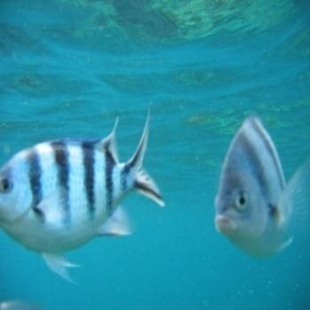                                    |
| `average`           | 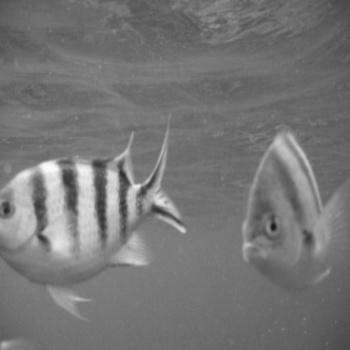                     |
| `average_luminance` | 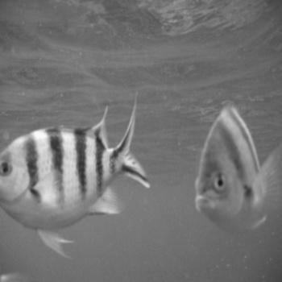 |
| `necg`              | 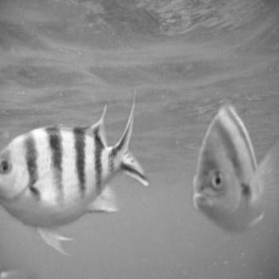                           |
| `snecg`             | 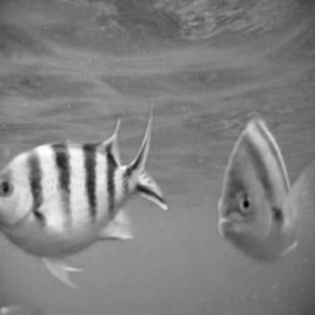                         |

## Fruits

| Conversion Method   | Image                                                                         |
| ------------------- | ----------------------------------------------------------------------------- |
| `original`          | 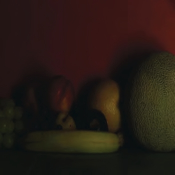                                    |
| `average`           |                      |
| `average_luminance` | 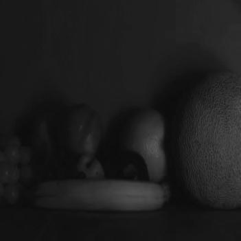 |
| `necg`              | 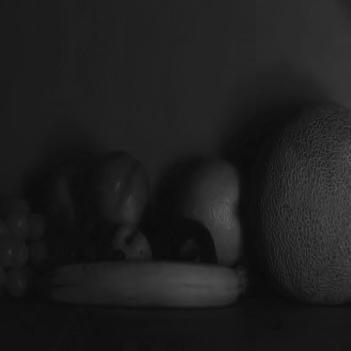                           |
| `snecg`             | 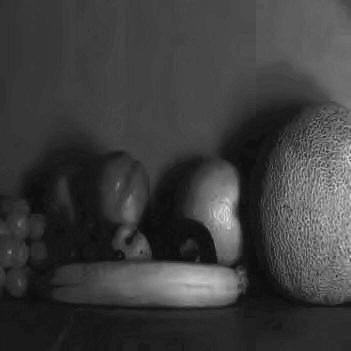                         |

## GretagMacbeth_ColorChecker

| Conversion Method   | Image                                                                                             |
| ------------------- | ------------------------------------------------------------------------------------------------- |
| `original`          | 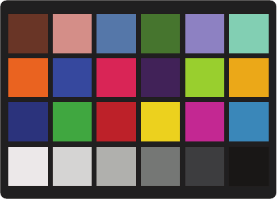                                    |
| `average`           |                      |
| `average_luminance` | 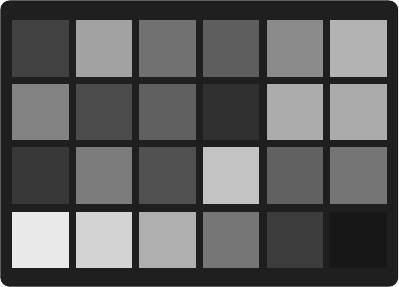 |
| `necg`              | 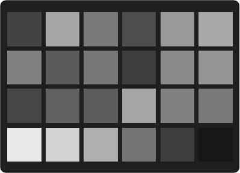                           |
| `snecg`             | 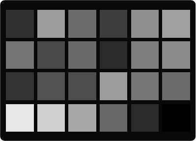                         |

## Red Lantern

| Conversion Method   | Image                                                                              |
| ------------------- | ---------------------------------------------------------------------------------- |
| `original`          |                                     |
| `average`           |                      |
| `average_luminance` |  |
| `necg`              |                            |
| `snecg`             |                          |

## Weave

| Conversion Method   | Image                                                                        |
| ------------------- | ---------------------------------------------------------------------------- |
| `original`          | 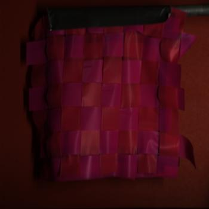                                    |
| `average`           | 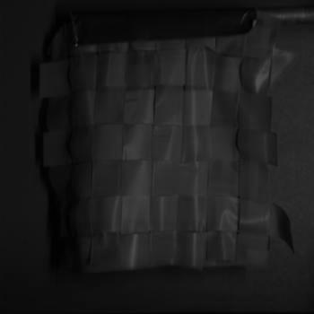                     |
| `average_luminance` | 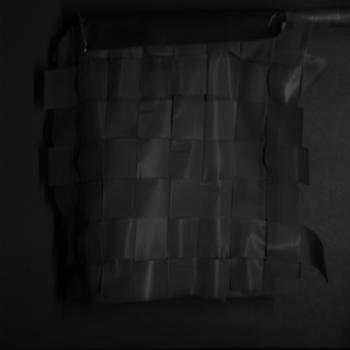 |
| `necg`              | 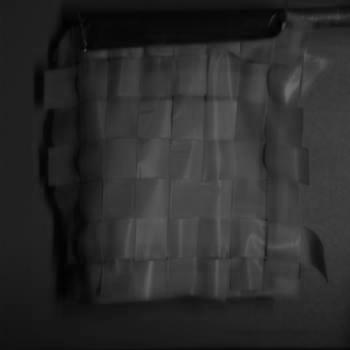                           |
| `snecg`             | 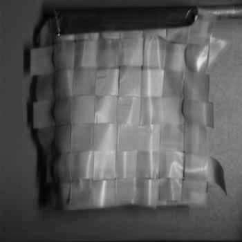                         |
